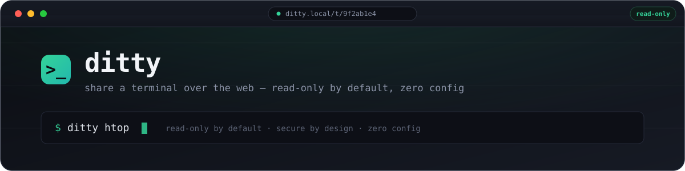

<p align="center">
  
</p>

<p align="center">
  <a href="https://github.com/0funct0ry/ditty/actions/workflows/test.yml"></a>
  <a href="https://github.com/0funct0ry/ditty/releases/latest"></a>
  <a href="https://github.com/0funct0ry/ditty/blob/main/LICENSE"></a>
</p>

# ditty

ditty shares a terminal over the web. It runs the command you give it, spawns a fresh PTY for each browser connection by default, and serves that terminal over HTTP and WebSocket, with no configuration file or setup step required to get a session running. A session is read-only unless you explicitly ask for `--writable`, and ditty refuses to bind to a non-loopback address until you configure an authentication method or explicitly opt out.

```bash
ditty htop
```

Running that prints a URL. Opening it shows a live, read-only view of `htop`. Nobody who has the link can type into the session unless you started ditty with `-w`.


## Installing

### Install script

```bash
curl -fsSL https://github.com/0funct0ry/ditty/releases/latest/download/install.sh | sh
```

This downloads and runs a script from the network. If you would rather read it first, that is a reasonable thing to want:

```bash
curl -fsSL https://github.com/0funct0ry/ditty/releases/latest/download/install.sh -o install.sh
less install.sh
sh install.sh
```

The script detects your OS and architecture, downloads the matching release archive, checks it against the published `SHA256SUMS`, and installs the `ditty` binary onto your `PATH`.

### Homebrew

```bash
brew install --cask 0funct0ry/tap/ditty
```

### Docker

```bash
docker run --rm -p 7654:7654 ghcr.io/0funct0ry/ditty:latest --insecure-no-auth htop
```

Two image variants are published: the default (`ghcr.io/0funct0ry/ditty:latest`) is built on a distroless base with no shell in the image at all, since the point is that ditty runs *your* command, not one of its own. The `-alpine` tag (`ghcr.io/0funct0ry/ditty:latest-alpine`) includes a shell, for cases where that is useful — for example, running a shell command directly inside the container image itself.

### Manual download

Prebuilt binaries for linux, darwin and freebsd (amd64 and arm64) are attached to each [release](https://github.com/0funct0ry/ditty/releases), alongside a `SHA256SUMS` file to verify them against.

There is currently no Windows build. ditty needs a real PTY and process-group signal handling to do its job, and that support does not exist for Windows yet.

## Security

`ditty` makes three specific promises, and the whole design follows from them:

1. **Read-only by default.** Nothing you type reaches the underlying command unless the session was started with `-w`/`--writable`. This is enforced on the server, at the point input would be forwarded to the process — not by hiding a text box in the browser.
2. **ditty will not silently expose a terminal to your network.** Binding to anything other than `127.0.0.1`, `localhost`, or a loopback address without configuring an authentication method stops ditty from starting, with this message:

   ```
   ditty: refusing to listen on <address> without authentication.

   This would expose <command> to your entire network.

   Pick one:
     --token                  random URL token (printed at startup)
     --basic-auth user:pass   HTTP basic authentication
     --auth-db ditty.db       SQLite users + JWT login page
     --client-ca ca.pem       mutual TLS
     --trust-header X-User    delegate to your reverse proxy
     --insecure-no-auth       I understand; do it anyway
   ```

3. **A random per-session URL token is generated and required by default**, even on loopback, unless you explicitly pass `--no-token`. Nothing about ditty's default configuration is "open by accident."

None of this changes what the program you are sharing can do. If you run `ditty -w vim` or `ditty -w less`, a writable terminal running either program is, in practical terms, a shell — `vim` has a `:!` command and `less` has its own escape to a shell. Read-only mode protects against accidental exposure of ditty itself; it says nothing about the safety of the program you point it at.

## Recipes

A few ways people actually use ditty:

- **Pair on the same session:** `ditty --shared -w bash` — one PTY, shared by everyone who connects, instead of a fresh one per browser tab.
- **Broadcast a read-only view:** `ditty htop` — anyone with the link can watch; nobody can type.
- **A disposable sandboxed shell:** `docker run --rm -it ghcr.io/0funct0ry/ditty --insecure-no-auth -w bash` — a shell scoped to a throwaway container, not your host.
- **Behind a reverse proxy with your own auth:** run ditty on a loopback or internal address and let `--trust-header`/`--trust-proxy` delegate identity to whatever sits in front of it (see `docker-compose.yml`'s `nginx` profile for a worked example).
- **A one-shot support link:** `ditty --once -w bash` — serves exactly one client, then exits, useful for handing someone a single-use terminal without leaving a long-running session behind.

## Building from source

```bash
make build   # bin/ditty
make run ARGS="-w bash"
make check   # every gate CI enforces
```

`make help` lists every target, including `make docker`, `make docker-alpine`, and `make smoke`. This project is pre-v1.0.0; see the [releases page](https://github.com/0funct0ry/ditty/releases) and commit history for what is implemented so far.

## License

MIT — see [LICENSE](LICENSE).
